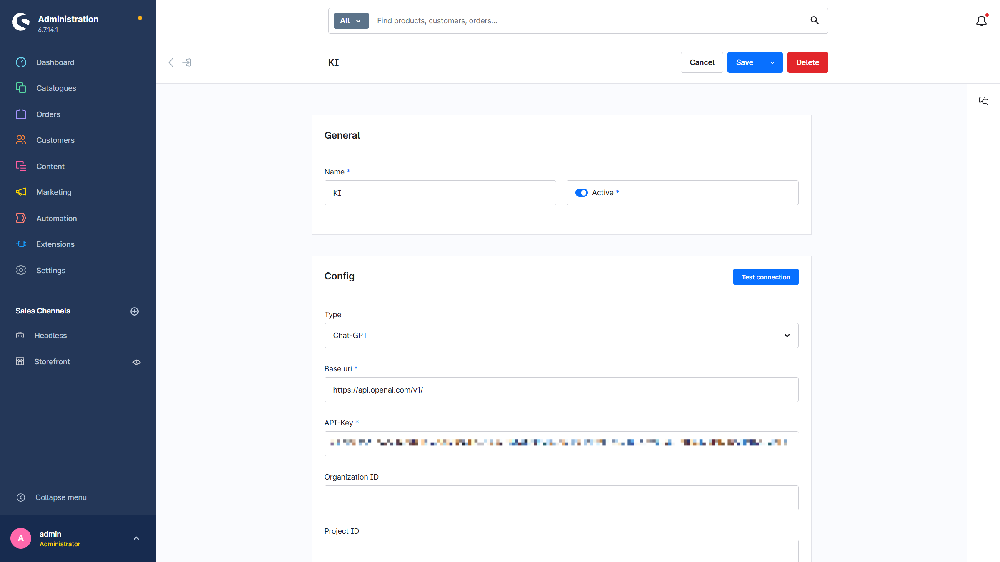
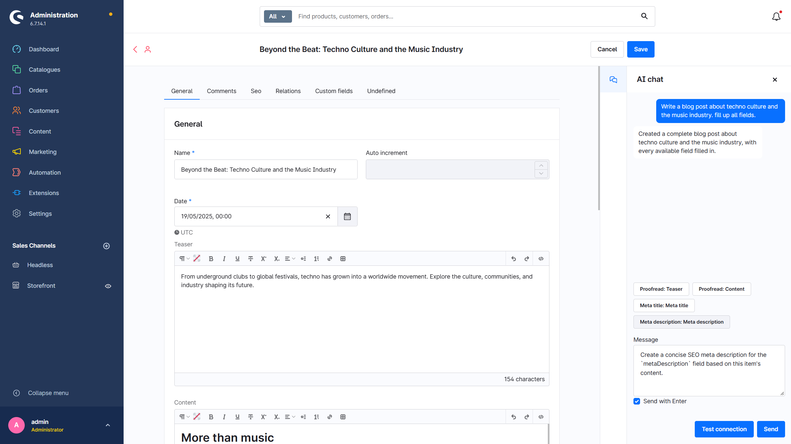

# Foundation | KI-Chat

verfügbar ab Shopware 6.7

Mit dem KI-Chat kannst du Inhalte in der Administration erstellen, überarbeiten und für Suchmaschinen optimieren. Der Chat kennt den Aufbau des aktuell geöffneten Eintrags sowie dessen vorhandene Werte und Medien.

## KI-Client einrichten

Lege unter **Erweiterungen > Clients** einen neuen Client an und wähle als Typ **Chat-GPT**. Hinterlege den API-Key, wähle Modell und Reasoning-Aufwand und prüfe die Konfiguration über **Verbindung testen**.

Unter **Erweiterungen > Moorl Foundation > KI** wählst du anschließend diesen Client als KI-Client aus.

Die Option **OpenAI-Antworten speichern** ist standardmäßig deaktiviert. Aktiviere sie nur, wenn OpenAI die Antworten speichern darf.

## KI-Chat verwenden

Öffne einen Eintrag in der Administration und klicke rechts auf das KI-Chat-Symbol. Neben freien Anweisungen stehen passende Vorschläge für verfügbare Felder bereit, zum Beispiel zum Korrekturlesen von Texten oder Erstellen von Meta-Daten.

Der Chat übermittelt beim ersten Request die Feldstruktur und bei jeder Nachricht den aktuellen Inhalt des Eintrags. Er kann Texte in direkten Feldern ändern und bezieht vorhandene Medien ein. Die Änderungen werden direkt im Formular angezeigt, müssen aber wie gewohnt noch über **Speichern** bestätigt werden.

Der Chat ist auch beim Anlegen neuer Einträge verfügbar. Aktiviere **Mit Enter senden**, um Nachrichten mit der Eingabetaste abzuschicken.

## Voraussetzung

Der Chat-GPT-Client verwendet die OpenAI API. Dafür wird ein API-Key mit aktivierter API-Abrechnung benötigt; ein ChatGPT- oder Codex-Abonnement reicht dafür nicht aus.
