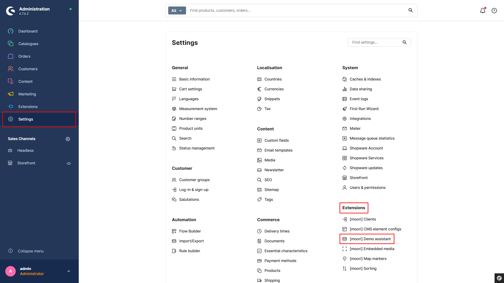
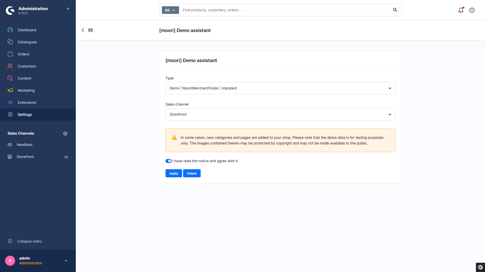
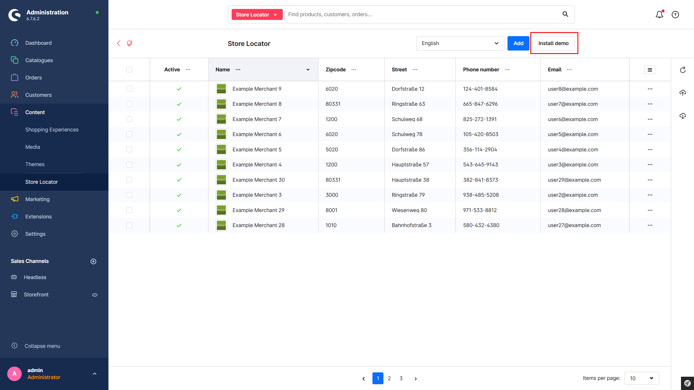

# Foundation | Demo Assistant

Available from Shopware 6.4

## Easily install demo data

Many plugins include preconfigured demo packages. These make it quick and easy to get to know plugins and understand them better.

## How does it work?

### Using the Demo Assistant

Via the main navigation in the admin: `Settings` → `Extensions` → `Demo Assistant`

There are two different types of data packages:

1. **The basic configuration**  
   This contains all data relevant to the plugin, such as SEO URL templates, email templates, shipping methods, and payment methods. If there is a problem with the plugin, it is recommended to reset the data using this option.

2. **The demo package**  
   A demo package is intended to provide a quick introduction to a plugin. It creates real data and structures, making it easier to get to know the plugin and work with the data.

Please note that the image materials are protected by copyright. The contents of the demo packages must therefore not be made publicly accessible.

### Plugin-specific demo packages

At the plugin’s entry point (usually in the listing overview), the recommended demo package can also be installed directly. Admin permissions are required for this; otherwise, the button is hidden.

