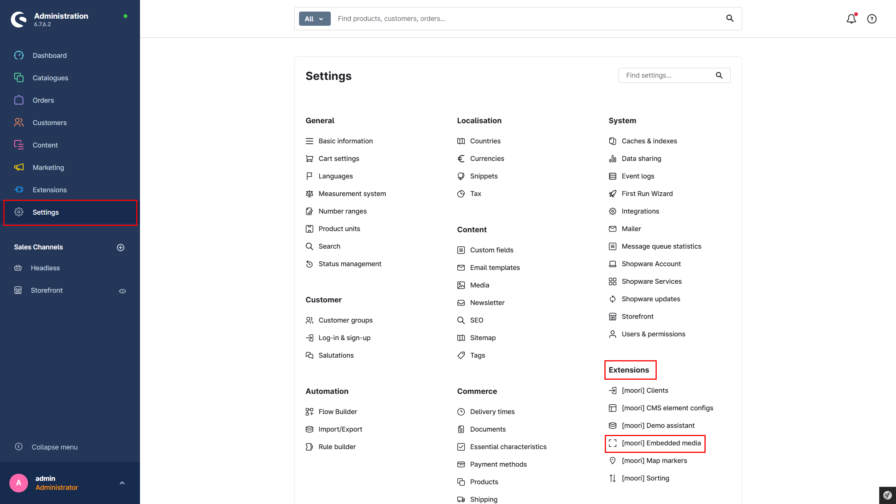
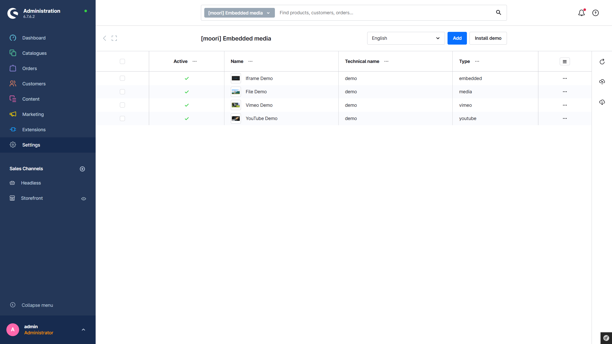
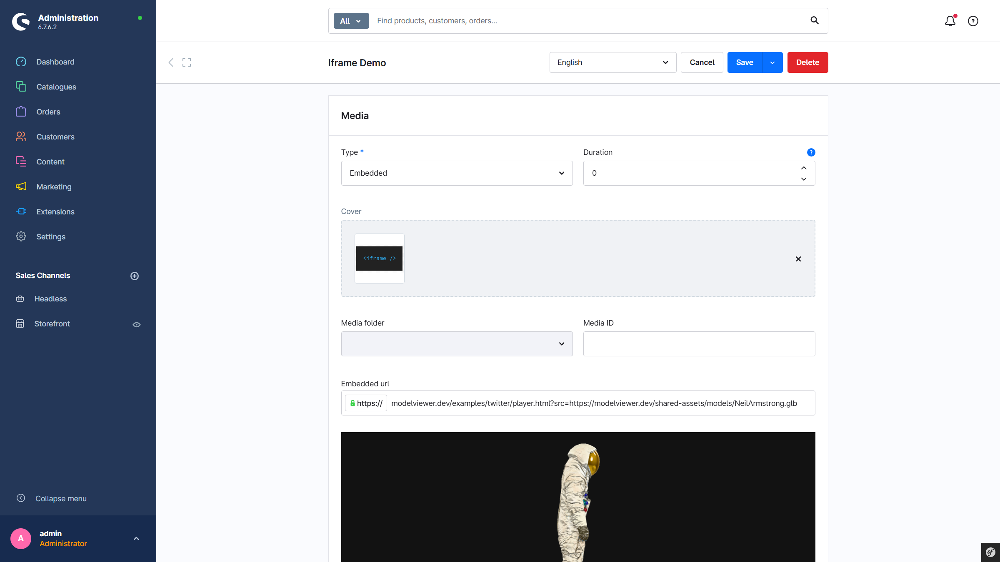
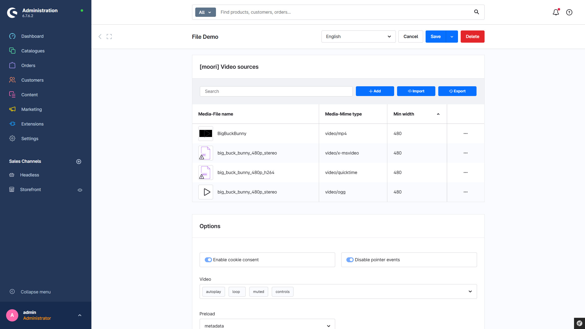
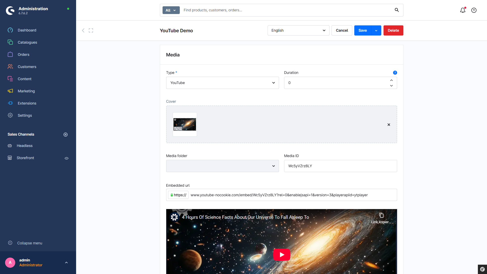
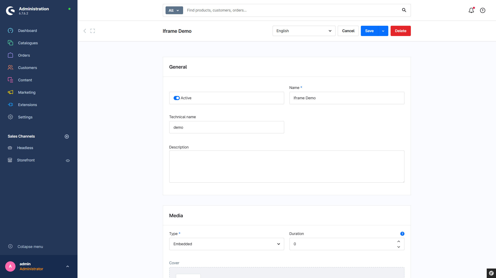

# Foundation | Eingebettete Medien

Verfügbar ab Shopware 6.7

Verwendet in:

- [Videos in den Produkt Details abspielen](../MoorlProductVideo/index.md)
- [Studygood](../AppflixStudygood/index.md)

## Wo der Medien-Manager von Shopware an seine Grenzen stößt ...

... beginnt der Einsatzbereich der Entität `Eingebettete Medien`. Diese ist eine Kombination aus Medien, IFrame-Inhalten und Videos, bestehend aus einem Cover, zusätzlichen Meta-Informationen und einer ausführlichen Beschreibung.

## Wie funktioniert das?

### Übersicht

Über die Hauptnavigation im Admin: `Einstellungen` → `Erweiterungen` → `Eingebettete Medien`

Es gibt folgende Typen von eingebetteten Medien:

1. **Automatische Zuweisung**
2. **Eingebettet** – z. B. IFrames
3. **Medien** – z. B. Videos aus dem Medien-Manager von Shopware
4. **Vimeo** – Vimeo-Videos mit Einbettungslink
5. **YouTube** – YouTube-Videos mit Einbettungslink
6. **Verzeichnis für 360-Bildbetrachter** – im Aufbau

### Zusätzliche Einstellungen

Je nach Typ können weitere Einstellungen vorgenommen werden, z. B. ein Cookie-Bestätigungsfeld bei YouTube-Videos oder externen Quellen (IFrames).

