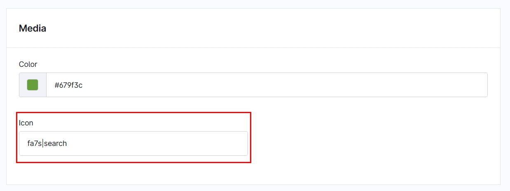
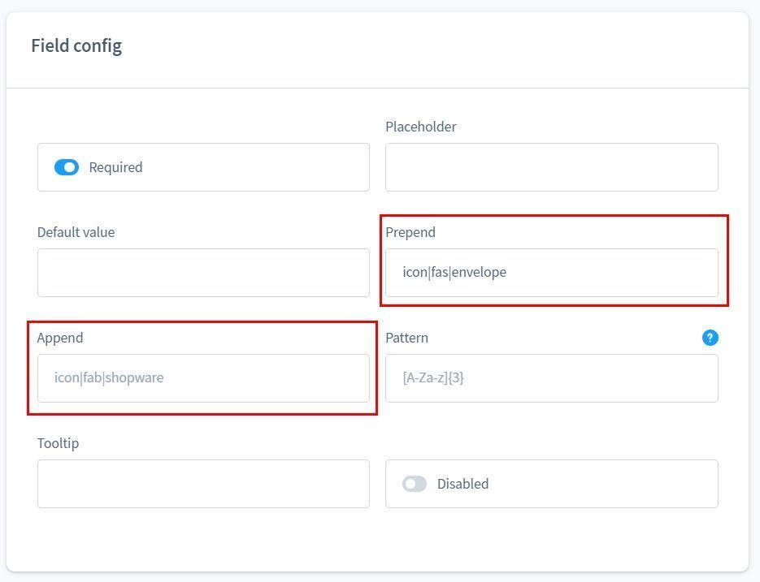

# Foundation | SVG Icons

Verfügbar ab Shopware 6.5

Verwendet in:

- [Appflix Kleinanzeigen](../AppflixCustomerMarket/index.md)
- [Formular Baukasten](../MoorlForms/index.md)

## Welche Icons sind verfügbar?

- Font Awesome 5: [https://fontawesome.com/v5/search](https://fontawesome.com/v5/search) – bis Shopware 6.6
- Font Awesome 6: [https://fontawesome.com/v6/search](https://fontawesome.com/v6/search)
- Font Awesome 7: [https://fontawesome.com/v7/search](https://fontawesome.com/v7/search) – ab Shopware 6.7
- Shopware: [https://developer.shopware.com/resources/meteor-icon-kit/](https://developer.shopware.com/resources/meteor-icon-kit/)

## Verwendung im Admin, z. B. über die Einstellungen

In den Einstellungen von Plugins und CMS-Elementen gibt es häufig das Eingabefeld `icon`. Dabei gibt es folgende Möglichkeiten:

Genereller Aufbau: `<Paketname>|<Name des Icons>|<Größe>`

- `solid|search` - Search-Icon aus dem Paket `Shopware Meteor Icon Kit | solid`
- `solid|search|xs` - Search-Icon aus dem Paket `Shopware Meteor Icon Kit | solid` in der Größe `xs`
- `fa7s|map` - Map-Icon aus dem Paket `Font Awesome 7 | solid`
- `fa7b|shopware` - Shopware-Icon aus dem Paket `Font Awesome 7 | brands`
- `fa6b|shopware|xs` - Shopware-Icon aus dem Paket `Font Awesome 6 | brands` in der Größe `xs`



In einigen Plugins gibt es die Möglichkeit, einen Text oder ein Icon einzufügen. In diesem Fall wird `icon` vorangestellt. Beispiel:

- `icon|solid|search` - Search-Icon aus dem Paket `Shopware Meteor Icon Kit | solid`
- `icon|solid|search|xs` - Search-Icon aus dem Paket `Shopware Meteor Icon Kit | solid` in der Größe `xs`
- `icon|fa7s|map` - Map-Icon aus dem Paket `Font Awesome 7 | solid`
- `icon|fa7b|shopware` - Shopware-Icon aus dem Paket `Font Awesome 7 | brands`
- `icon|fa6b|shopware|xs` - Shopware-Icon aus dem Paket `Font Awesome 6 | brands` in der Größe `xs`



## Verwendung im Twig-Template

Map-Icon aus dem Paket `Font Awesome 7 | solid` in der Größe `xs`

```twig

```

Search-Icon aus dem Paket `Shopware Meteor Icon Kit | solid` in Größe `xs`

```twig

```
